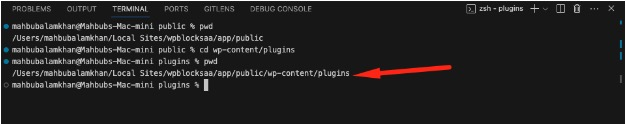
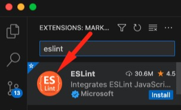
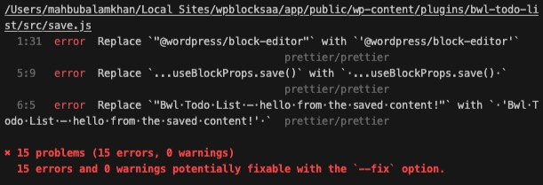

## Table of contents

- [Initialize a Gutenberg Block](#initialize-a-Gutenberg-block)
- [VS Code Editor Settings](#vs-code-editor-settings)
- [JS LINTING](#js-linting)
- [STYLE LINTING](#style-linting)
- [Configure Husky](#configure-husky)

## Initialize a Gutenberg Block

1. Go to the `wp-content/plugins`folder.
   

2. Run this command to create a plugin called `bwl-todo-list`.

```bash
npx @wordpress/create-block@latest bwl-todo-list
```

3. Type `y` to proceed with the installation.


4. Based on your internet speed, completing the installation process will take a while. So, keep patience.


5. Once everything is completed, you will get this screen.


6. Now, inside the plugins folder, you will see the new plugin.


7. Using the command line, enter that folder and run the following command.

```bash
npm start
```

It will compile all the JavaScript and SASS files. Also, keep watching for any changes and automatically compile the new SASS and JavaScript files.


8. Now, change the meta information inside the bwl-todo-list.php file.


9. Next, go to the src/block.json file.


In the `block.json` file, the most important tag is the **name**. So, do not forget to update the name value.


10. All is good! Now, we have to log in to the WordPress admin panel and activate the plugin.


11. Now, our plugin is activated, and we should see our new block. Go to any page. Click the **Plus** icon to add a new block and search for the **to-do**. You will see the output in the following screenshot.


### Change the block icon

1. Navigate to the **block.json** file. From the [WordPress Dashicon](https://developer.wordpress.org/resource/dashicons) site, we can choose our icon. Replace the icon value with your preferred icon.


#### Example


### Block File Structure

1. There are a couple of files inside the src folder. Index.js file loads the required files from the back-end and front-end editors. The edit.js file is used for the back-end editor, and the save.js file produces the output for the front end.
2. React and JSX knowledge are required to add options to the blocks.
3. Do not use any direct HTML inside the edit function. Instead, use the **wp-components** to create all the input, textarea, and dropdown fields.

## VS Code Editor Settings

We need to add some custom settings code for the VS code editor. Please note that, you need to create a folder called `.vscode`. Next, create a file called `settings.json` and add this codes into that file.

```json
{
  "json.schemas": [],
  "editor.formatOnSave": true,
  "workbench.settings.useSplitJSON": true,

  "[scss]": {
    "editor.formatOnSave": false,
    "editor.codeActionsOnSave": {
      "source.fixAll.stylelint": "always"
    }
  }
}
```

**Important Note:** Always add this `.vscode` folder into your editors root directory.


## JS LINTING

The js linting option checks for any JavaScript errors or unused variables. Write the following command to check the status of JS linting.

### Configure Prettier for JSlint

There is a known issue between Prettier and JS Lint. Prettier automatically formats the code and converts a single quote (‘) to a double quote ("). However, JS Lint considers it an error, and it expects a single quote (').

1. Install the ESLint extension on Visual Studio code.



2. Next, we need to install `eslint-plugin` package. Run the command.

```bash
npm install @wordpress/eslint-plugin --save-dev
```

**Ref:** https://developer.wordpress.org/block-editor/reference-guides/packages/packages-eslint-plugin/

3. Install the `prettier-config` package.

```bash
npm install @wordpress/prettier-config --save-dev
```

**Ref:** https://developer.wordpress.org/block-editor/reference-guides/packages/packages-prettier-config/

4. Next, open the **package.json** file and add the codes.

```JSON
"prettier": "@wordpress/prettier-config"
```

**Example**


5. Install `eslint-config-prettier` package will disable all the unnecessary rules for prettier and more conflicting items.

```bash
npm install --save-dev eslint-config-prettier
```

6. Create a **.eslintrc** file in the plugin root directory. Add the code to that file.

```JSON
{
  "extends": ["plugin:@wordpress/eslint-plugin/recommended-with-formatting", "prettier"]
}
```

7. Finaly, run this command to check the javascript errors.

```bash
npm run lint:js
```



## STYLE LINTING

1. Install the **stylelint** extension in the Visual Studio Code editor.


2. Now, install `stylelint-config`package.

```bash
npm install @wordpress/stylelint-config --save-dev
```

**Ref:** https://developer.wordpress.org/block-editor/reference-guides/packages/packages-stylelint-config/

3. Open package.json file and add this code.

```json
"stylelint": {
	"extends": "@wordpress/stylelint-config/scss"
}
```


4. We need to install a package to fix the style linting issue in the format automatically.

```bash
npm install --save-dev stylelint
```

5. Run the command to check the `.scss` file codes.

```bash
npx stylelint "**/*.scss"
```

6. Finally, we need to update that code to `package.json`.

```json
"format": "wp-scripts format && stylelint \"**/*.scss\" --fix"
```


So, when we run the following command, it will automatically format the code.

```bash
npm run format
```

## Configure Husky

If there are errors in JavaScript and CSS files, **Husky** will prevent committing any chnages.

### Install Husky

1. Run this command to install Husky.

```bash
npm install husky -D
```

**Ref:** https://github.com/typicode/husky

2. Open the `package.json` file and add this code.

```json
"prepare": "husky install"
```


3. Now, run this command and it will create a `.husky` directory inside the project root.

```bash
npm run prepare
```


4. Next, run the `hook` command. This command will create a `pre-commit` file. We will update the command in the next steps.

```bash
npx husky add .husky/pre-commit "npm test"
```


5. Add the `lint-staged` package. It will checks only the staged `js or scss`files.

```bash
npm i -D lint-staged
```

6. Finally, open the `package.json` file and add the `lint-staged` code.

```json
"lint-staged": {
		"*.js": [
			"wp-scripts lint-js",
			"wp-scripts format"
		],
		"*.scss": "npx stylelint --fix"
	},
```

7. Now try to commit the changes.

```bash
git commit -m "first commit"
```


That's it.

### Acknowledgement

- [bluewindlab.net](https://bluewindlab.net)
