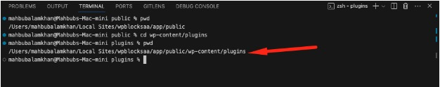

## Initialize a Gutenberg Block

1. Go to the `wp-content/plugins`folder.
   
2. Run this command to create a plugin called `bwl-todo-list`.

```bash
npx @wordpress/create-block@latest bwl-todo-list
```

Type `y` to proceed with the installation.


Based on your internet speed, completing the installation process will take a while. So, keep patience.


